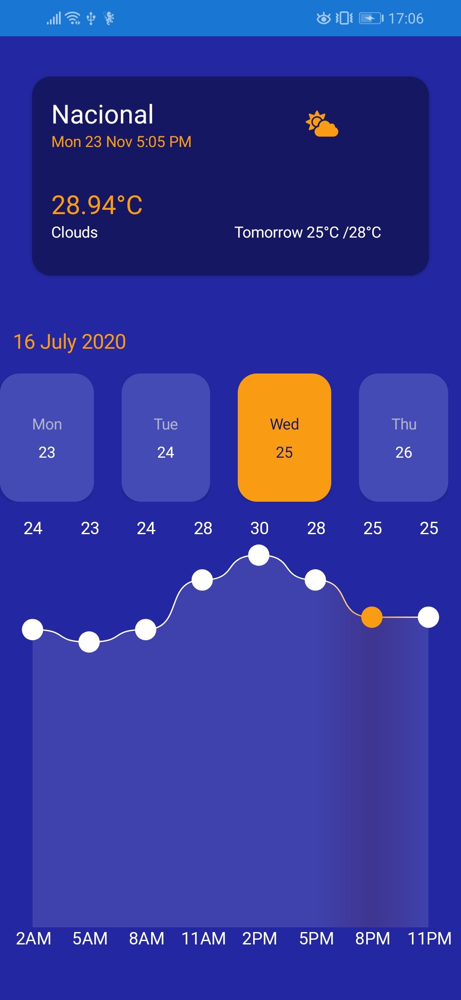

# XFWeatherApp

Weather App is a simple weather application developed with Xamarin Forms

The design is inspired by [this](https://dribbble.com/shots/14516691-Weather-App) dribbble shot.

## How to run

### Run project

1. Clone the repository using `git clone https://github.com/davjvo/XFWeatherApp.git` in your terminal

2. Launch the solution with Visual Studio 2017 or Visual Studio 2019

3. Check the setup files

4. Run the project

### Setup

- Navigate to ~\XFWeatherApp\XFWeatherApp\Utils\AppSetting.cs and configure your [Open weather map](https://rapidapi.com/community/api/open-weather-map) ApiKey

## Features

- [x] Xamarin Forms
- [x] Mvvm Architecture
- [x] API Consumption
- [x] Cache
- [x] Geolocation
- [x] Embeded Fonts
- [x] Microcharts

## Working platforms

- [x] Android
- [x] iOS

## Nuget Packages

### Prism

Prism is a framework for building loosely coupled, maintainable, and testable XAML applications in WPF, and Xamarin Forms.

### Refit

Library heavily inspired by Square's Retrofit library, and it turns your REST API into a live interface.

### Newtonsoft.Json

.Net JSON object serializer and deserializer.

### Fody

Injects code which raises the PropertyChanged event, into property setters of classes which implement INotifyPropertyChanged.

### Monkey cache

Monkey Cache is a .NET Standard 2.0 library, but has some platform specific tweaks for storing data in the correct Cache directory.

## APIs Consumed

### Open weather map

Historical Weather & Weather Forecasts

#### API Features

- Get current weather for location

- Get forecast for location

### Place Autocomplete

The Place Autocomplete service is a web service that returns place predictions in response to an HTTP request.

### Place Details

The Place Details service is a web service that returns place details in response to an HTTP request.

### App Images

